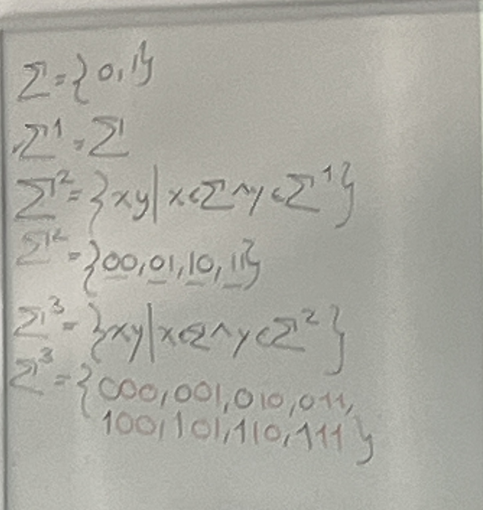

# Implementación de métodos computacionales

Teoría de la computación: mates discretas, programación paralela y funcional.

Computación evolutiva, machine learning, AutoML. Estancias de investigación de 7mo, programas de becarios, etc. con el profe.

CETEC Sur 5, CT536

## Sesión #1

53%, 47%: 12 quizzes (12%), 3 exámenes (15%), 8 tareas (20%).

Conjuntos: colección de elementos representado como enumeración o descripción con predicados

- $A=\{1,2,3,\ldots\}$

- $A=\{a\in \mathbb{N}|a<4\}$

Notación:

La inclusión se usa siempre con llaves a la izquierda ya que compara conjunto - conjunto. La pertenencia usa siempre la forma elemento - conjunto.

## Sesión #2

Producto cartesiano entre dos conjuntos es la multiplicación cartesiana entre dos conjuntos. Es decir, cada elemento de uno con cada elemento del otro.

Conjunto potencia: conjunto que contiene todos los subconjuntos de cierto conjuntos. Su tamaño se denota por $|P(A)|=2^{|A|}$.

Relaciones y funciones: una relación es un subconjunto dentro del producto cartesiano entre dos conjuntos. Por ejemplo, la relación $\le$ es una relación sobre $\mathbb{N}\times\mathbb{N}$, es decir, la relación entre el primer conjunto con el segundo. Se puede escribir como: $\le\subseteq\mathbb{N}^2$, ya que una relación es un subconjunto. 

Una función depende de que a toda $x$ existe una única $f(x)$, es decir, para todo elemento en el dominio existe un único valor para él en el co-dominio. Para una relación esto no es necesario, y por eso una relación no es lo mismo que una función.

Diagrama de Hasse: para mostrar todos los elementos en una relación, es decir, todas las tuplas en order con una flecha.

Reflexividad: una relación es reflexiva si (y solo si) contiene para cada elemento en el conjunto por lo menos una tupla interior que sea reflexiva (que se contiene únicamente a sí mismo pero dos veces). Todos las tuplas conteniendo su mismo elemento varias veces es reflexiva, como $(1,1)$, ó $(2,2,2)$, etc. Se puede expresar como:

 $\exists(a,a)\in R, \forall\ a\in A$.

Transitividad: que todos los elementos tengan caminos con absolutamente todos los demás elementos (investigar más). Es que cada vez que existan 3 nodos encadenadas con 2 tuplas, entonces exista una tercera tupla "cerrando el ciclo".

Simetría: si todas las tuplas vistas al revés se encuentran en la relación.

## Sesión #3

Un alfabeto $\Sigma$ es un conjunto finito de símbolos. Por ejemplo, el alfabeto en español: $\Sigma_{español}=\{a,b,c,\ldots,ñ,\ldots,x,y,z\}$

La potencia de un alfabeto se define recursivamente a partir de sus anteriores potencias. El caso base es un alfabeto de tamaño 1, pues su único símbolo es su potencia. 

Las potencias son todas las combinaciones posibles de cierto $\Sigma$ de $n$ elementos (que es un número entero positivo  $n\in\mathbb{Z^+}$).

En la figura arriba en el último renglón, los números negros son $x$, que vienen de $\Sigma$ (1d arr), y los dos rojos son $y$, que vienen de $\Sigma^2$ (2d arr).

$\emptyset \ne \epsilon$, el conjunto vació no es lo mismo a la palabra vacía. $x\epsilon=x$, es como el elemento neutro de la multiplicación. Por eso es que $\Sigma^0={\epsilon}$.

Cuantos elementos hay en $\Sigma^{100}$?

Hay $|\Sigma^n|=|\Sigma|^n$

$\Sigma^+$ es el conjunto de todas las palabras de tamaño 1, unión el conjunto de todas las palabras de tamaño 2, unión el conjunto... de tamaño 3, unión... tamaño 4, y hasta $n$. Recordar que $n$ es la cantidad de símbolos.

$\Sigma^{*}$ es lo mismo pero desde el cero, es decir, también contiene el conjunto de palabra nula $\{\epsilon\}$.

Dos palabras $w_1$ y $w_2$ son iguales si para todo carácter contenido en una palabra la primera palabra $w_1$ está en la misma posición que en la segunda palabra $w_2$.

Una palabra es una concatenación de otras palabras contenidas en $\Sigma^{*}$. 

$x^{n+1}=xx^n$

## Sesión #4

Cuaderno

Un autómata finito determinista (DFA) es una quíntupla. La definición formal es $M=(Q,\Sigma,\delta,q,F)$. Algoritmos definidos formalmente.

- $Q$: estado de la máquina

- $\Sigma$: alfabeto

- $\delta$: dado un estado y un símbolo del alfabeto, es una función que toma ambos y te dice a donde ir

- $q\in Q$: estado inicial

- $F\subseteq Q$: donde es viable que la maquina reconozca una palabra en el lenguaje

Siempre debemos tener n x m transiciones cuando tenemos n estados y m símbolos debido a $\delta=Q\times \Sigma\rightarrow Q$.

## Sesión #5

Un problema de diseñar un DFA para cierta condición de número de símbolos o alguna otra se puede resolver usando diversas cantidades de estados. Estos estados los define la persona para resolver el problema. Óptimamente la cantidad de estados debe ser la mínima y existen diversas maneras de minimizar los estados de una implementación.

## Sesión #6

A contrario de un DFA (que es deterministico), un NFA se refiere a cuando estando en un mismo estado podemos transitar hacia dos estados diferentes al mismo tiempo y por ello no es deterministico.

El no determinismo nos ayuda a evitar complicaciones en sistemas deterministas. Esto funciona porque se ejecutan múltiples caminos al mismo tiempo al definir dos rumbos distintos para una misma entrada, lo cuál divide en ramas a una transición.

Por ejemplo, leer todas las entradas para de un sistema.

Un NFA no se puede programar con un sistema común como Python.

En la concatenación de sistemas se deben de eliminar los estados de aceptación de los sistemas anteriores

**CHECAR PRESENTACIÓN PORQUE ESTO NO ES TODO**

## Sesión #7

Teorema para poder intercambiar de NFA a DFA

Los lenguajes regulares son reconocidos por lenguajes deterministas, que a su vez a otros no deterministas.

Se definen primero los estados dentro del diagrama. Estos estados 

En algún momento llegamos a nuestra tabla de $\delta$ para el nuevo DFA. 

Ver este video para entender:

https://www.youtube.com/watch?v=Y92dtMnarAU

## Sesión #8

Una expresión regular $R$ es la descripción del lenguaje.

Por ejemplo:

$L=L(M)=\{w|w\ \text{termina en}\ 00\}=\Sigma^{*}00$

Algunas identidades de las expresiones regulares:

- $R\ \cup \emptyset=R$
- $R\cdot\varepsilon=\varepsilon\cdot R=R$
- $R\cup\varepsilon \ne R$
- $R\odot\emptyset=R\emptyset=\emptyset$

Jerarquía de operaciones:

1. Estrella
2. Concatenación
3. Unión

Construcción de diagramas de transiciones a partir de expresiones regulares:

## Sesión \#11

Gramáticas libres de contexto

$G=(V,\Sigma,R,S)$

donde

- $V$ es un conjunto finito de variables, conjunto de símbolos no terminales
- $\Sigma$ es un conjunto finito disconjunto (no tienen elementos que hacen intersección) de $V$, conjunto de símbolos terminales
- $S$ es la variable inicial, a fuerzas es no terminal, por lo que $S\in V$.
- $R$ son las reglas de derivación

Las gramáticas libres de contexto son generadores de lenguajes, mientras que con los DFAs reconocemos lenguajes. 

Para todo lenguaje regular se puede generar una gramática  libre de contexto, pero no toda G.L.C puede ser convertida en un lenguaje regular. Un ejemplo de esto es el lenguaje:

$L=\{a^nb^n|n\in\mathbb{N}\}$.

![[Pasted image 20240402144157.png]]

En el ejemplo anterior se está remplazando $S\rightarrow aSb$. Esto funciona como una "asignación", que claramente es recursiva, pues depende de sí misma. En vez de "asignación", le podemos llamar a esto una regla. Podemos combinar reglas como querramos, por lo que en un momento dado podemos "terminar la recursión" y aplicar la segunda regla $S\rightarrow\varepsilon$.

## Sesión \#12

Para derivación se agarra primero la variable inicial y empezamos a agarrar reglas para esa variable. La línea vertical es solamente como n separador, no es un símbolo.

Las gramáticas regulares son gramáticas creadoras de lenguajes regulares.

[Muy buena explicación](https://web.stanford.edu/class/archive/cs/cs103/cs103.1164/lectures/18/Small18.pdf)

## Sesión \#13

Un buen truco es primero diseñar el automata y luego intentar hacerlo una gramática libre de contexto.

Autómatas de pila (PPA)

$M=(Q,\Sigma,\Gamma,\delta,q_0,F)$

donde cambian algunas definiciones específicas de los autómatas de antes

- $\delta : Q\times \Sigma\times \Gamma \rightarrow P(Q\times \Gamma)$, donde el primero es de lectura y el segundo de escritura

[Muy buena explicación x2](https://web.stanford.edu/class/archive/cs/cs103/cs103.1132/lectures/17/Small17.pdf)

## Sesión \#14

Cada entrada de la tabla representa una tupla donde se define (x, y), donde:

- x: Estado hacia donde la transición nos lleva
- y: Que char se coloca hasta arriba de la pila (la parte de la derecha de $\rightarrow$).

Conversión de gramáticas libres de contexto a autómatas de pila

## Sesión \#15

Explicación del reto del bloque (a grandes rasgos)

